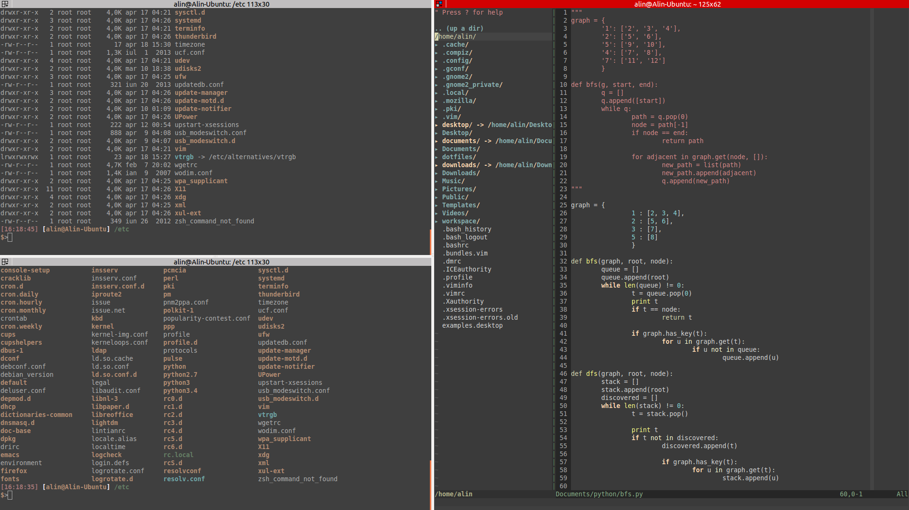

Zenburn-for-Terminator
======================

Zenburn color scheme for the Terminator terminal emulator

How to install:

1. Create a config file for your terminator if you don't have one already:  
  ```mkdir -p ~/.config/terminator/```

2. Clone this repository somewhere:  
  ```git clone https://github.com/alinmindroc/Zenburn-for-Terminator```

3. Copy the config file in the terminator config directory:  
  ```cp Zenburn-for-Terminator/config ~/.config/terminator/```

4. Restart terminator

Screenshot:

